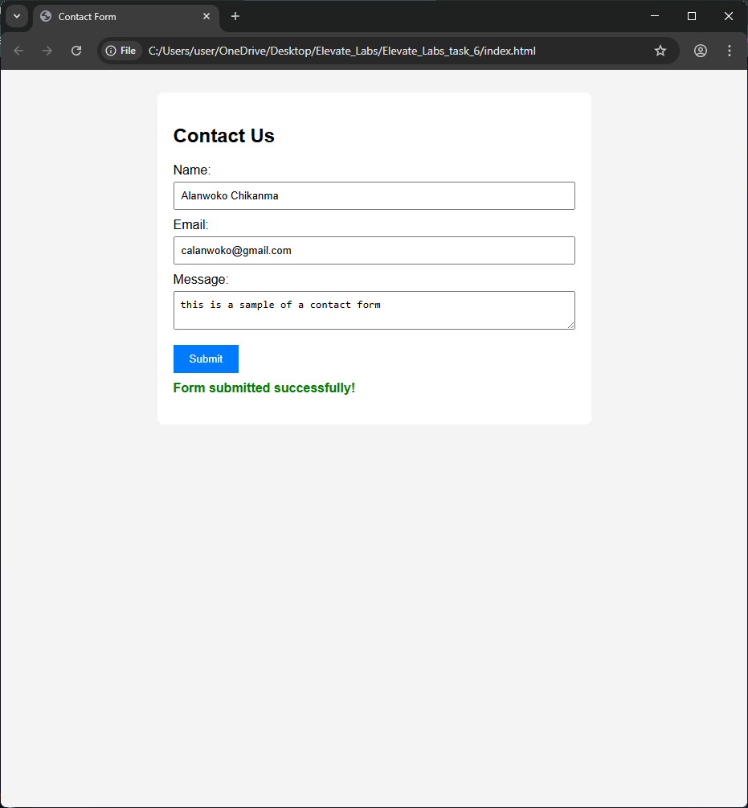

# Elevate_Labs_task_6
Creating a Contact Form and Validate Inputs Using JavaScript

# Contact Form with JavaScript Validation

This project is part of a web development internship task. It includes:

- A contact form with fields for name, email, and message.
- Client-side validation using JavaScript.
- Regex-based email format checking.
- Dynamic error messages and success feedback.

## Technologies Used
- HTML
- CSS
- JavaScript

## How to Run
Open `index.html` in any browser (e.g., Chrome). Fill out the form and test validation.

## Author
Alanwoko

## Preview

